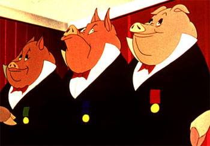

!SLIDE start

!SLIDE splash

# Practical testing
# for assorted languages

#### Jonas Nicklas – @jonicklas

!SLIDE blue

# ♥ programming ♥

!SLIDE blue

# ♥ testing ♥

!SLIDE blue

# ♥ Ruby ♥

!SLIDE blue

# ☢ JavaScript ☢

!SLIDE

# Ruby
## Beautiful
## Well structured
## Well tested

!SLIDE

# JavaScript
## Ugly
## Not structured
## Not tested

!SLIDE

# We don't accept this
# for Ruby

!SLIDE

# We should not accept this
# for JavaScript

!SLIDE

# All codes are created equal

!SLIDE

# 
## (some are more equal than others)

!SLIDE

# _Why?

!SLIDE

# Neglected

!SLIDE

# Rails doesn't help

!SLIDE

# Not ”real” code

!SLIDE purple

# Today
## JavaScript design
## JavaScript unit testing
## Integration testing

!SLIDE purple

# It's not hard

!SLIDE purple

# Treat your JavaScript better
